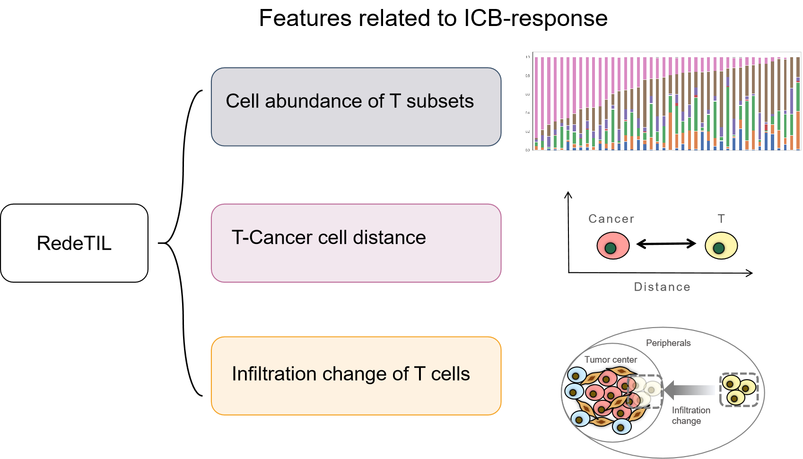
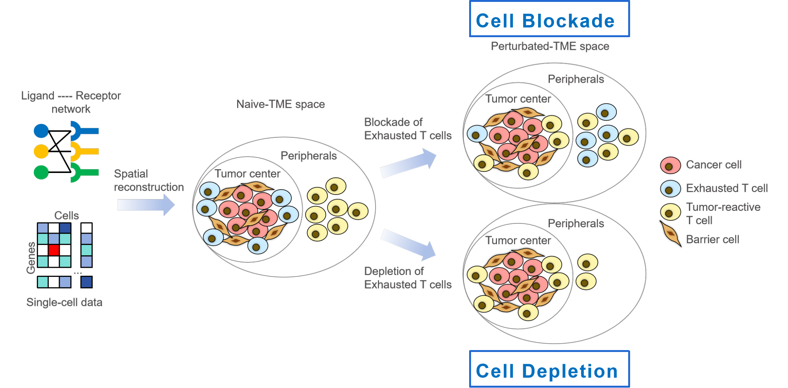

# RedeTIL Features
## Project Introduction
A Python package for analyzing single-cell data using RedeTIL features. This package provides tools to calculate abundance, spatial, and dynamic features of single-cell data, to predict clinical response to Immune checkpoint blockade (ICB) therapy for individual patients. 



## Installation

You can install the `rede_til` package using pip:

```bash
pip install git+https://github.com/gaoshengqiao/RedeTIL
```

## Usage
### Initialization
First, you need to import the RedeTIL_Features class and initialize an instance with single-cell data. The single-cell data should be provided in AnnData format, where data.obs must contain the 'label' column for cell annotations.
```
from rede_til import RedeTIL_Features
import scanpy as sc
```
### Load your single-cell data
```
adata = sc.read_h5ad('path_to_your_data.h5ad')
```
### Initialize RedeTIL_Features
```
redetil = RedeTIL_Features(adata, target='PDCD1', perturbation='block',
                           T_cells='T-cell', Cancer_cells='malignant',
                           outdir='./results')
```
### Abundance Features
Previous studies have found the existence/abundance of several T cell subtypes is related to the outcome of ICB treatment, such as tumor-reactive T cells (CXCL13+ T, CD39+CD8+ T), stressed T cells (HSP1A1+ T), exhausted T cells (PDCD1+CD8+ T), stem-like T cells (CXCR5+CD8+ T, TCF1+/TCF7+ T), activated T cells (CD69+ T, TNFRSF9+CD8+ T). Their proportions reflect the state of the TME from different aspect. 
To calculate the abundance features of specific gene+ cell subsets:
```
redetil.Abundance_features()
```
This will generate a file Abundance_features.txt in the specified output directory, containing the frequency of each gene+ cell subset in different cell types.

### Spatial Features
Spatial-omics-based studies have revealed the spatial relationship between T-cancer cell distance and ICB-response, Here we use CSOmap (https://www.nature.com/articles/s41422-020-0353-2) to reconstruct the spatial feature of TME to estimate the T-cancer cell distance.
To reconstruct the spatial topology of cells and calculate spatial features:
```
redetil.Spatial_features(plot=True)
```
This will generate several files in the Spatial_features directory, including:
- cellinfo_tbl.txt: Cell information table with coordinates and labels.
- Cell-Cell_connections.txt: Cell-cell interaction pairs.
- Cell-Cell_connections_qvalue.txt: Adjusted q-values for cell-cell interactions.
- Detailed_connections.txt: Detailed connections between cells.
- Rank Cell-Cell_Distance.txt: Rank distance matrix.
- Euclidean Cell-Cell_Distance.txt: Euclidean distance matrix.
- Ligand-receptor_contribution.txt: Contribution of ligand-receptor pairs.
If plot=True, it will also generate 3D and 2D plots of the cell spatial distribution and interaction maps.

### Dynamic Features
We define a dynamic features named infiltration change metric of T cells, that is, the movement process of T cells approaching tumor cells. During the cancer-immunity cycle, T cells need to migrate from peripheral tissues to the interior of tumor tissues. Infiltration change metric reflects the process, and we assume an effective local immune response in TME if T cells can infiltrate into tumor tissues.
The modes of simulating treated group are 'cell blocked' and 'cell depletion'. 'Cell blocked' simulation specifically decreased the affinity score of target cells (expressing target genes) with other cells to 70% of original affinity score, to perturb original cell-cell interaction network. 'Cell depletion' simulation specifically removed the target cells.



To calculate the infiltration change, which simulate the proximity of T cells to cancer cells after receiving drug perturbation:
```
redetil.Dynamic_features(plot=True)
```
This will generate several files in the Dynamic_features directory, including:
- Perturbated Spatial_features/: Directory containing perturbated spatial features.
- Dynamic_features.txt: Infiltration change of T cells to cancer cells by comparing pertubated and naive space.
If plot=True, it will also generate plots of the perturbated cell spatial distribution and interaction maps.

### Example
Here is a an example to demonstrate the usage of RedeTIL_Features:
```
from rede_til import RedeTIL_Features
import scanpy as sc
# Load single-cell data
adata = sc.read_h5ad('./demo/demo.h5ad')

# One target perturbation
redetil = RedeTIL_Features(adata, target='PDCD1', perturbation='block',
                            T_cells='T-cell', Cancer_cells='malignant')
redetil.Abundance_features()
redetil.Spatial_features(plot=True)
redetil.Dynamic_features(plot=True)
```

when simulating the treatment of combined drugs:
```
# Targets combo
redetil = RedeTIL_Features(adata, target='PDCD1', combo_target='VEGFA', perturbation='block',
                            T_cells='T-cell', Cancer_cells='malignant')
redetil.Dynamic_features(plot=True)
```

## Contact
For any questions or issues, please contact [renxwise@cpl.ac.cn] or [292966713@qq.com].

## License
This project is licensed under the MIT License.

